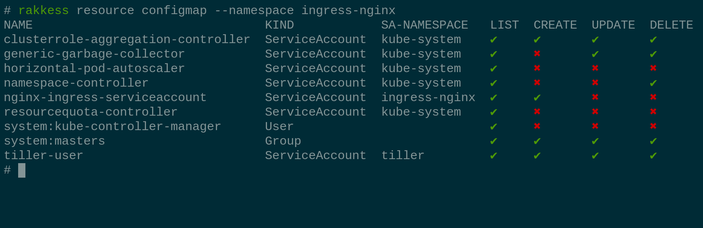

# rakkess
[](https://travis-ci.com/corneliusweig/rakkess)
[](https://codecov.io/gh/corneliusweig/rakkess)
[](https://goreportcard.com/report/corneliusweig/rakkess)
[](https://github.com/corneliusweig/rakkess/blob/master/LICENSE)
[](https://github.com/corneliusweig/rakkess/releases)

Review Access - kubectl plugin to show an access matrix for server resources

## Intro
Have you ever wondered what access rights you have on a provided kubernetes cluster?
For single resources you can use `kubectl auth can-i list deployments`, but maybe you are looking for a complete overview?
This is what `rakkess` is for.
It lists access rights for the current user and all server resources.

It is also useful to find out who can hamper with some server resource.
Check out the sub-command `rakkess resource` [below](#show-subjects-with-access-to-a-given-resource).

## Demo


## Examples
#### Show access for all resources
- ... at cluster scope
  ```bash
  rakkess
  ```

- ... in some namespace
  ```bash
  rakkess --namespace default
  ```

- ... with verbs
  ```bash
  rakkess --verbs get,delete,watch,patch
  ```

- ... for another user
  ```bash
  rakkess --as other-user
  ```

- ... for another service-account
  ```bash
  rakkess --sa kube-system:namespace-controller
  ```

- ... and combine with common `kubectl` parameters
  ```bash
  KUBECONFIG=otherconfig rakkess --context other-context
  ```
  
#### Show subjects with access to a given resource

- ...globally in all namespaces (only considers `ClusterRoleBindings`)
  ```bash
  rakkess resource configmaps
  ```
  
- ...in a given namespace (considers `RoleBindings` and `ClusterRoleBindings`)
  ```bash
  rakkess resource configmaps -n default
  ```

- ...with shorthand notation
  ```bash
  rakkess r cm   # same as rakkess resource configmaps
  ```

- .. with custom verbs
  ```bash
  rakkess r cm --verbs get,delete,watch,patch
  ```
  
##### Name-restricted roles
Some roles only apply to resources with a specific name.
To review such configurations, provide the resource name as additional argument.
For example, show access rights for the `ConfigMap` called `ingress-controller-leader-nginx` in namespace `ingress-nginx`:

```bash
rakkess r cm ingress-controller-leader-nginx -n ingress-nginx --verbs=all
```
  
As `rakkess resource` needs to query `Roles`, `ClusterRoles`, and their bindings, it usually requires administrative cluster access.

Also see [Usage](doc/USAGE.md).

## Installation
There are several ways to install `rakkess`. The recommended installation method is via `krew`.

### Via krew
Krew is a `kubectl` plugin manager. If you have not yet installed `krew`, get it at
[https://github.com/kubernetes-sigs/krew](https://github.com/kubernetes-sigs/krew).
Then installation is as simple as
```bash
kubectl krew install access-matrix
```
The plugin will be available as `kubectl access-matrix`, see [doc/USAGE](doc/USAGE.md) for further details.

### Binaries
When using the binaries for installation, also have a look at [doc/USAGE](doc/USAGE.md).

#### Linux
```bash
curl -Lo rakkess.gz https://github.com/corneliusweig/rakkess/releases/download/v0.3.0/rakkess-linux-amd64.gz && \
  gunzip rakkess.gz && chmod +x rakkess && mv rakkess $GOPATH/bin/
```

#### OSX
```bash
curl -Lo rakkess.gz https://github.com/corneliusweig/rakkess/releases/download/v0.3.0/rakkess-darwin-amd64.gz && \
  gunzip rakkess.gz && chmod +x rakkess && mv rakkess $GOPATH/bin/
```

#### Windows
[https://github.com/corneliusweig/rakkess/releases/download/v0.3.0/rakkess-windows-amd64.zip](https://github.com/corneliusweig/rakkess/releases/download/v0.3.0/rakkess-windows-amd64.zip)

### From source

#### Build on host

Requirements:
 - go 1.11 or newer
 - GNU make
 - git

Compiling:
```bash
export PLATFORMS=$(go env GOOS)
make all   # binaries will be placed in out/
```

#### Build in docker
Requirements:
 - docker

Compiling:
```bash
mkdir rakkess && chdir rakkess
curl -Lo Dockerfile https://raw.githubusercontent.com/corneliusweig/rakkess/master/Dockerfile
docker build . -t rakkess-builder
docker run --rm -v $PWD:/go/bin/ --env PLATFORMS=$(go env GOOS) rakkess
docker rmi rakkess-builder
```
Binaries will be placed in the current directory.

## Users

| What are others saying about rakkess? |
| ---- |
| _“Well, that looks handy! `rakkess`, a kubectl plugin to show an access matrix for all available resources.”_ – [@mhausenblas](https://twitter.com/mhausenblas/status/1100673166303739905) |
| _“that's indeed pretty helpful. `rakkess --as system:serviceaccount:my-ns:my-sa -n my-ns` prints the access matrix of a service account in a namespace”_ – [@fakod](https://twitter.com/fakod/status/1100764745957658626) |
| _“THE BOMB. Love it.”_ – [@ralph_squillace](https://twitter.com/ralph_squillace/status/1100844255830896640) |
| _“This made my day. Well, not actually today but I definitively will use it a lot.”_ – [@Soukron](https://twitter.com/Soukron/status/1100690060129775617) |

