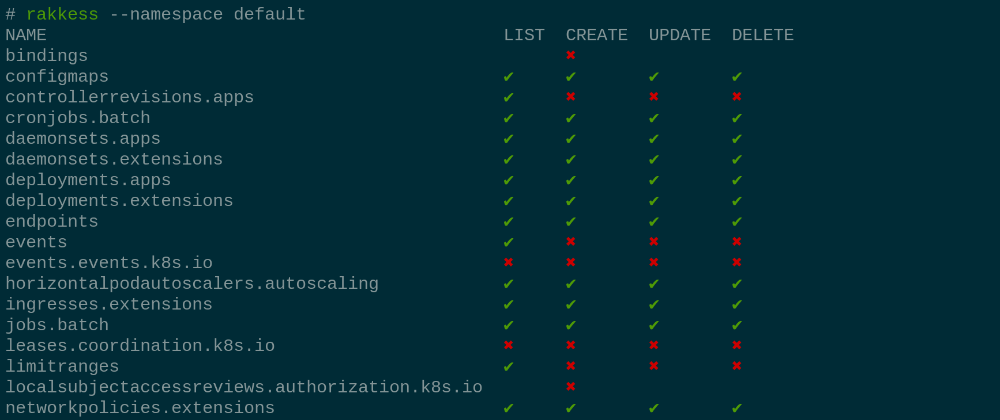

<!-- DO NOT MOVE THIS FILE, BECAUSE IT NEEDS A PERMANENT ADDRESS -->

# Usage


If you installed via [krew](https://github.com/kubernetes-sigs/krew) do
```bash
kubectl access-matrix
```

## Options

- `--verbs` show access for given verbs (valid verbs are `create`, `get`, `list`, `watch`, `update`, `patch`, `delete`, and `deletecollection`).
   It also accepts the shorthands `*` or `all` to enable all verbs.

- `--namespace` show access rights for the given namespace. Also restricts the list to namespaced resources.

- `--verbosity` set the log level (one of debug, info, warn, error, fatal, panic).

- `--sa` like the `--as` option, but impersonate as a service-account. The service-account must either be qualified with its namespace (`--sa <namespace>:<sa-name>`) or be combined with the `--namespace` option.
   The following is equivalent:
   ```bash
   kubectl access-matrix --sa <sa-name> -n <namespace>
   kubectl access-matrix --sa <namespace>:<sa-name> -n <namespace>
   ```

   _Note_: this is a shorthand for `--as system:serviceaccount:<namespace>:<sa-name>`.

## Examples
#### Show access to all resources
- ... at cluster scope
  ```bash
  kubectl access-matrix
  ```
  This defaults to the verbs `list`, `create`, `update`, and `delete` because they are the most common ones.

- ... in some namespace
  ```bash
  kubectl access-matrix --namespace default
  ```

- ... with verbs
  ```bash
  kubectl access-matrix --verbs get,delete,watch,patch
  ```

- ... for another user
  ```bash
  kubectl access-matrix --as other-user
  ```

- ... for another service-account
  ```bash
  kubectl access-matrix --sa kube-system:namespace-controller
  ```

- ... and combine with common `kubectl` parameters
  ```bash
  KUBECONFIG=otherconfig kubectl access-matrix --context other-context

#### Show subjects with access to a given resource

- ...globally in all namespaces (only `ClusterRoleBindings`)
  ```bash
  kubectl access-matrix resource configmaps
  ```
  
- ...in a given namespace (`RoleBindings` and `ClusterRoleBindings`)
  ```bash
  kubectl access-matrix resource configmaps -n default
  ```

- ...with shorthand notation
  ```bash
  kubectl access-matrix r cm   # same as kubectl access-matrix resource configmaps
  ```

- .. with custom verbs
  ```bash
  kubectl access-matrix r cm --verbs get,delete,watch,patch
  ```
  
##### Name-restricted roles
Some roles only apply to resources with a specific name.
To review such configurations, provide the resource name as additional argument.
For example, consider `ConfigMaps` with name `ingress-controller-leader-nginx` in namespace `ingress-nginx`:

```bash
kubectl access-matrix r cm ingress-controller-leader-nginx -n ingress-nginx --verbs=all
```
  
As `kubectl access-matrix resource` needs to query `Roles`, `ClusterRoles`, and their bindings, it usually requires administrative cluster access.

## Getting help
```bash
kubectl access-matrix help
```
Note that in the help, the tool is referred to as `rakkess`, which is the standard name when installed as stand-alone tool.

## Completion
Completion does currently not work when used as a `kubectl` plugin. When used stand-alone, you can do
```bash
source <(rakkess completion bash) # for bash users
source <(rakkess completion zsh)  # for zsh users
```
Also see `rakkess completion --help` for further instructions.

## Installation

### Via krew
If you do not have `krew` installed, visit [https://github.com/kubernetes-sigs/krew](https://github.com/kubernetes-sigs/krew).
```bash
kubectl krew install access-matrix
```

### As `kubectl` plugin
Most users will have installed `rakkess` via [krew](https://github.com/kubernetes-sigs/krew),
so the plugin is already correctly installed.
Otherwise, rename `rakkess` to `kubectl-access_matrix` and put it in some directory from your `$PATH` variable.
Then you can invoke the plugin via `kubectl access-matrix`

### Standalone
Put the `rakkess` binary in some directory from your `$PATH` variable. For example
```bash
sudo mv -i rakkess /usr/bin/rakkess
```
Then you can invoke the plugin via `rakkess`
